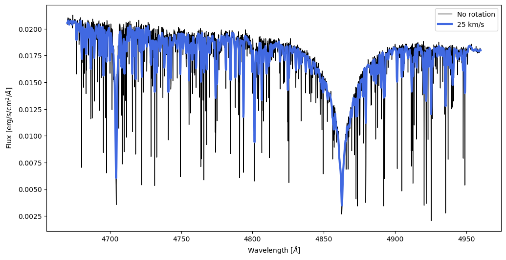
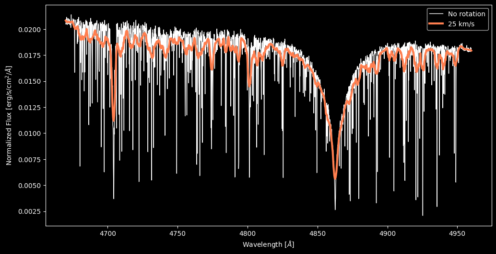
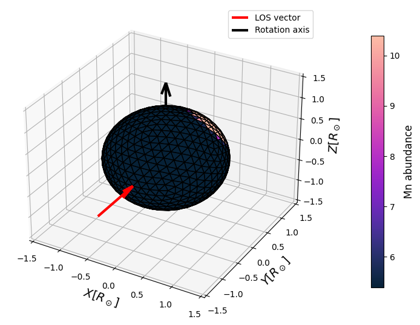
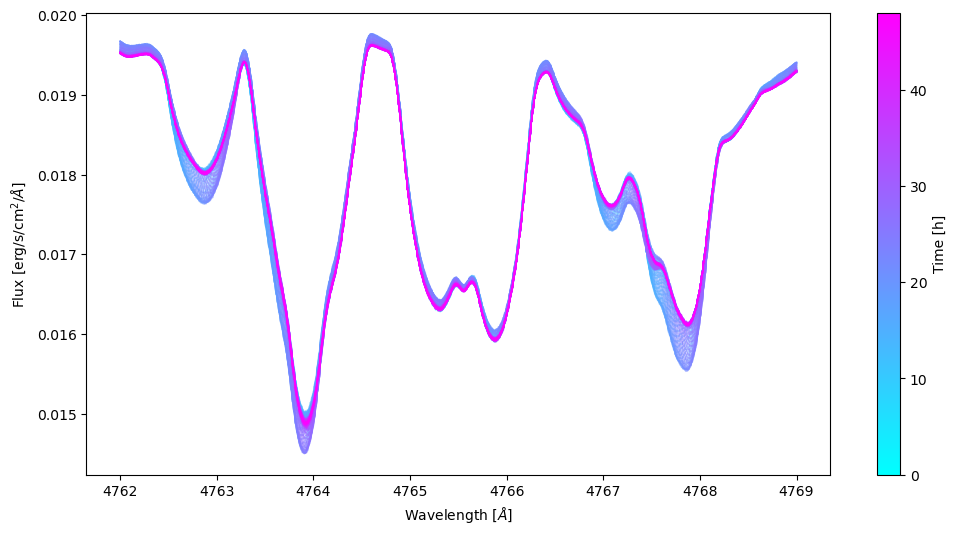
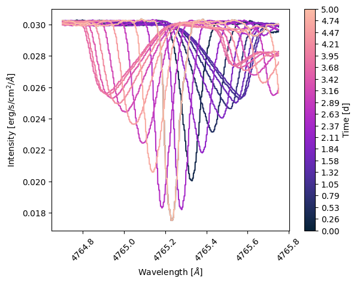
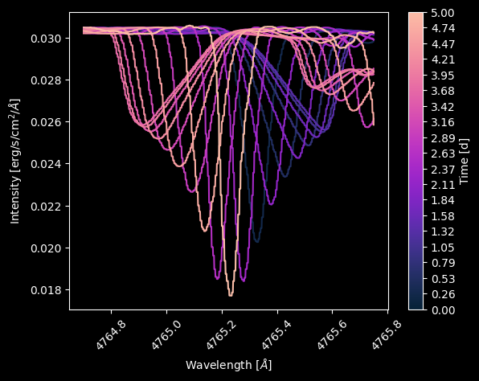

Machine-Learning Emulators (aemu)
=================================

For realistic spectra from neural-network emulators, SPICE integrates with
the ``astro-emulators-toolkit`` (**aemu**) — trained emulators are packaged
as *bundles* (weights + parameter contract + scaling metadata) that SPICE
wraps behind the standard :class:`~spice.spectrum.SpectrumEmulator`
interface. This supersedes the earlier direct TransformerPayne integration;
TPayne-architecture models are now consumed as aemu bundles.

Install with:

.. code-block:: bash

    pip install "stellar-spice[aemu]"

.. note::

   Every code snippet and figure on this page has a matching section in the companion notebook
   `tutorial/docs_examples/aemu_examples.ipynb <https://github.com/maja-jablonska/spice/blob/main/tutorial/docs_examples/aemu_examples.ipynb>`_
   (requires the ``aemu`` extra; bundle downloads need network access).

Loading a bundle
----------------

A bundle name may be a Hugging Face repo id or a local bundle directory
(e.g. from your own training run):

.. code-block:: python

    from spice.spectrum import IntensityPretrainedAemuSpectrumEmulator

    emu = IntensityPretrainedAemuSpectrumEmulator("RozanskiT/TPayne-spice-small-random")

    # The parameter contract comes from the bundle:
    print(emu.stellar_parameter_names)

Three wrapper classes cover the bundle flavors:

:class:`~spice.spectrum.IntensityPretrainedAemuSpectrumEmulator`
    Wavelength-conditioned, two-channel (line + continuum), log10-output
    **intensity** bundles whose inputs include ``mu``. The natural choice
    for :func:`~spice.spectrum.simulate_observed_flux`.

:class:`~spice.spectrum.FluxPretrainedAemuSpectrumEmulator`
    Fixed-grid, single-channel **flux** bundles sampled on the wavelength
    grid baked into the bundle; angle dependence comes from
    flux-conservation limb darkening.

:class:`~spice.spectrum.AemuSpectrumEmulator`
    The generic base wrapper around an already-loaded ``aemu.Emulator``
    instance, for bundles that don't match the two pretrained layouts.

Input/output min-max scaling declared by the bundle (both the older split
``reference_scaling_inputs``/``outputs`` layout and the newer combined
``reference_scaling`` block) is applied automatically.

.. warning::

   TPayne-style bundles expect the temperature as ``logteff``
   (log10 Kelvin), not linear ``teff`` — check
   ``emu.stellar_parameter_names`` and see :doc:`conventions`.

Synthesizing spectra
--------------------

The wrappers plug into the standard workflow — build a mesh with the
bundle's parameters, then synthesize:

.. code-block:: python

    import numpy as np
    import jax.numpy as jnp
    from spice.models import IcosphereModel
    from spice.spectrum import simulate_observed_flux
    from spice.models.mesh_transform import add_rotation, evaluate_rotation

    m = IcosphereModel.construct(1000, 1., 1.,
                                 emu.to_parameters(dict(logteff=jnp.log10(7000), logg=4.3)),
                                 emu.stellar_parameter_names)

    mt = evaluate_rotation(add_rotation(m, 100, jnp.array([0., 1., 0.])), 0.)

    vws = np.linspace(4670, 4960, 2000)
    spec_no_rot = simulate_observed_flux(emu.intensity, m, jnp.log10(vws))
    spec_rot = simulate_observed_flux(emu.intensity, mt, jnp.log10(vws))

Abundance spots and line profiles
---------------------------------

Because bundle parameters typically include individual abundances, surface
abundance patterns become time-dependent line-profile variations. A
manganese spot on a rotating star:

.. code-block:: python

    from spice.models.spots import add_spot

    timestamps = np.linspace(0, 48*3600, 100)

    m_spotted = add_spot(m, spot_center_theta=1., spot_center_phi=1., spot_radius=30.,
                         parameter_delta=5.0,
                         parameter_index=emu.stellar_parameter_names.index('Mn'))
    m_spotted = [evaluate_rotation(add_rotation(m_spotted, 25.), t) for t in timestamps]

    vws = np.linspace(4762, 4769, 2000)
    spec_rot_spotted = [simulate_observed_flux(emu.intensity, _m, jnp.log10(vws))
                        for _m in m_spotted]

Similarly, pulsating models produce phase-dependent line profiles (see the
companion notebook for the full plotting code):

.. code-block:: python

    from spice.models.mesh_transform import add_pulsation, evaluate_pulsations

    mp = add_pulsation(m, 0, 0, 5., jnp.array([[1e-4, 0.]]))  # period in days

    TIMESTAMPS = jnp.linspace(0., 5., 20)
    mps = [evaluate_pulsations(mp, t) for t in TIMESTAMPS]
    specs = [simulate_observed_flux(emu.intensity, _m, jnp.log10(vws)) for _m in mps]

.. note::

   The figures on this page were produced with the TPayne-architecture
   predecessor of the current bundles; running the companion notebook with
   an intensity bundle regenerates them with the emulator you choose.
