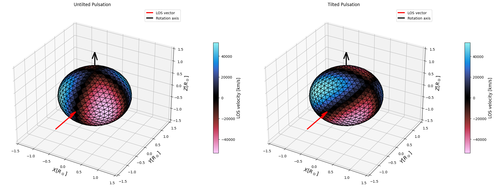
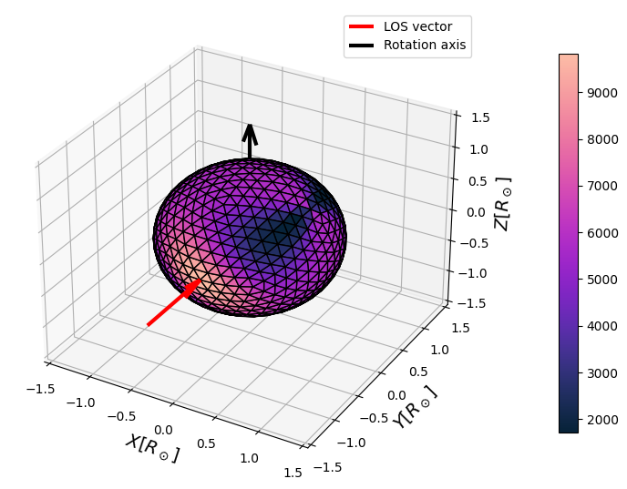
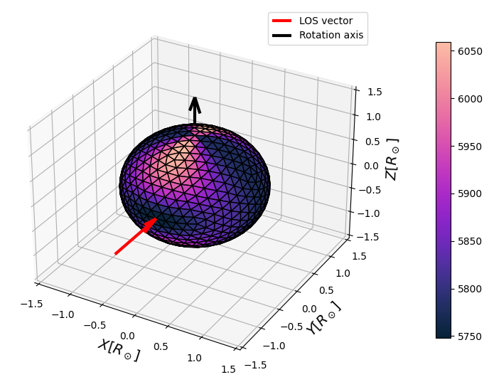

Creating a Mesh Model
===========================

The SPICE library provides functionality to create and manipulate icosphere models, which are useful for representing stellar surfaces. Here's how you can create and modify an icosphere model:

Basic Icosphere Creation
------------------------

To create a basic icosphere model, you can use the `IcosphereModel.construct()` method:

.. code-block:: python

    from spice.models import IcosphereModel
    from transformer_payne import Blackbody

    # Initialize a Blackbody model (for spectrum calculation)
    bb = Blackbody()

    # Create an icosphere model
    m = IcosphereModel.construct(
        10000,  # Minimal number of vertices
        1.,     # Radius in solar radii
        1.,     # Mass in solar masses
        bb.to_parameters(),  # Parameters for the spectrum model
        bb.parameter_names   # Names of the parameters used to match between overridable parameters and mesh parameters
    )

The parameter of vertices is the minimal number of vertices for the icosphere. The actual number of vertices will be higher, and depends on the refinement level.
Icosphere is a tessellation of a sphere, and the number of mesh elements is given by the formula:

.. math::
    V = 5 \times 4^{L+1}

where L is the level of refinement.

The following table shows the number of vertices for different refinement levels:

.. list-table:: Icosphere Refinement Levels
   :header-rows: 1
   :widths: 25 25

   * - Refinement Level
     - Number of Vertices
   * - 1
     - 80
   * - 2
     - 320
   * - 3
     - 1280
   * - 4
     - 5120
   * - 5
     - 20480

The icosphere model requires a spectrum model to be provided, which is used to calculate the parameters of each vertex.
In the case of the Blackbody model, the parameters are the temperature, but more complex models contain more parameters such as logg, individual abundances, etc.
In principle, any model can be used for the spectrum, and the model can contain any number of parameters - as long as the parameters are defined in the spectrum model.

Some parameters may be fixed for the mesh, and some may be overridable - for example, logg depends on the mass and radius, so it may be calculated automatically from the parameters in the case of
distorted models, e.g. pulsation or rotation.

Adding Rotation
---------------

SPICE has a functional API, which means that all transformations are done using functions that return a new model instance.

You can add rotation to your model using the `add_rotation()` function:

.. code-block:: python

    from spice.models.mesh_transform import add_rotation, evaluate_rotation
    import jax.numpy as jnp

    # Add rotation to the model
    rm = add_rotation(
        m, # Model instance
        rotation_velocity=10., # Rotation velocity in km/s
        rotation_axis=jnp.array([0, 0, 1]) # Rotation axis (relative to the model center)
    )  # Rotate around z-axis

    t = 1. # time in seconds

    # To get the rotated mesh at a specific time:
    rotated_mesh = evaluate_rotation(rm, t)  # t is the time in seconds

Visualizing the Mesh
--------------------

SPICE provides functionality to visualize the mesh model. You can use the `plot_3D` function from the `spice.plots.plot_mesh` module to create a 3D visualization of your mesh.

Here's an example of how to visualize a mesh with rotation:

.. code-block:: python

    from spice.plots import plot_3D
    import matplotlib.pyplot as plt

    fig, axes = plot_3D(
        rotated_mesh,
        'los_velocities', # property to be mapped - can be either a string or an integer
        cmap='magma'
    )

This will create a 3D plot of your mesh, colored by the 'los_velocities' property (which represents the line-of-sight velocities).

Here's an example of what the output should look like:

.. image:: ../img/rotated_mesh.png
   :width: 600
   :alt: 3D visualization of a rotated mesh

In this image, you can see the 3D structure of the mesh, with colors representing the 'los_velocities' values. The red arrow indicates the line of sight, and the black arrow shows the rotation axis.

You can customize the visualization by changing the `property` parameter. For example, you could use 'los_velocities' to color the mesh by line-of-sight velocities, or 'mus' to show the angle between the normal and the line of sight.

Adding Pulsation
----------------

To add pulsation to your model, you can use the `add_pulsation()` function:

.. code-block:: python

    from spice.models.mesh_transform import add_pulsation, evaluate_pulsations

    # Add pulsation to the model
    mp = add_pulsation(
        m, # Model instance
        1, # m order
        1, # n degree
        100., # pulsation period
        jnp.array([[0.5, 0.]]) # Fourier series parameters
    )

    t = 40. # time in the same unit as the pulsation period

    # To get the pulsated mesh at a specific time:
    pulsated_mesh = evaluate_pulsations(mp, t)  # t is the time

Note that the time and pulsation period can be any time units, as long as they are consistent.

The pulsation amplitude is given by the fourier series parameters. It can be calculated using the following function:

.. math::

   A = D + \sum_{n=1}^N A_n \cos\left(\frac{2\pi n}{P}t - \phi_n\right)

where :math:`D` is the mean amplitude, :math:`A_n` are the amplitudes, :math:`\phi_n` are the phases, and :math:`P` is the pulsation period.
The amplitude corresponds to the percent of the original radius.

The Fourier series parameters are provided as a 2D array with shape (N, 2), where N is the number of terms in the series. Each row contains [A_n, phi_n], where A_n is the amplitude and phi_n is the phase for the nth term. For example, [[0.1, 0.0], [0.05, 1.57]] represents a series with two terms: the first with amplitude 0.1 and phase 0, and the second with amplitude 0.05 and phase π/2.
Again, note that the amplitude is given in percent of the original radius.

This example pulsation will look like this:

.. image:: ../img/pulsated_mesh.png
   :width: 600
   :alt: 3D visualization of a pulsation

Of course, this is a highly unrealistic, exaggarated pulsation, but it shows the effect of pulsation on the mesh.

Tilted Pulsation Axis
^^^^^^^^^^^^^^^^^^^^^

You can also define pulsations with an axis different from the rotation axis. This is done by specifying the `pulsation_axes` and `pulsation_angles` parameters in the `add_pulsation()` function:

.. code-block:: python

    from spice.models.mesh_transform import add_pulsation, evaluate_pulsations
    import jax.numpy as jnp

    # Create a basic model (assuming 'm' is already defined)
    
    # Add a tilted pulsation
    tilted_m = add_pulsation(
        m,  # Model instance
        0,  # m order
        1,  # n degree
        2.,  # pulsation period
        jnp.array([[1e-1, 0.]]),  # Fourier series parameters
        pulsation_axes=jnp.array([0., 1., 0.]),  # Tilt axis (y-axis in this case)
        pulsation_angles=jnp.array([45.])  # Tilt angle in degrees
    )

    # Evaluate the pulsation at a specific time
    t = 0.5  # time in the same unit as the pulsation period
    tilted_pulsated_m = evaluate_pulsations(tilted_m, t)

This will create a pulsation with its axis tilted 45 degrees around the y-axis. You can visualize the difference between an untilted and tilted pulsation:

.. code-block:: python

    from spice.plots.plot_mesh import plot_3D
    import matplotlib.pyplot as plt

    # Create an untilted pulsation for comparison
    m = IcosphereModel.construct(1000, 1., 1.,
                                bb.to_parameters(), bb.parameter_names)
    untilted_m = add_pulsation(m, 0, 1, 2., jnp.array([[1e-1, 0.]]))
    tilted_m = add_pulsation(m, 0, 1, 2., jnp.array([[1e-1, 0.]]), pulsation_axes=jnp.array([0., 1., 0.]), pulsation_angles=jnp.array([45.]))

    untilted_pulsated_m = evaluate_pulsations(untilted_m, 0.5)
    tilted_pulsated_m = evaluate_pulsations(tilted_m, 0.5)

    fig, (ax1, ax2) = plt.subplots(1, 2, figsize=(20, 10), subplot_kw={'projection': '3d'})

    plot_3D(untilted_pulsated_m, property='los_velocities', cmap='magma', axes=(fig, ax1))
    ax1.set_title('Untilted Pulsation')

    plot_3D(tilted_pulsated_m, property='los_velocities', cmap='magma', axes=(fig, ax2))
    ax2.set_title('Tilted Pulsation')

    plt.tight_layout()
    plt.show()

This will produce a visualization showing the difference between untilted and tilted pulsations:

Adding Temperature Spots
------------------------

You can add temperature spots to your model using spherical harmonics:

.. code-block:: python

    from spice.models.spots import add_spherical_harmonic_spot

    base_temp = 5700
    spot_temp = 15000

    # Add temperature spots
    m = add_spherical_harmonic_spot(
        m, # Model instance
        4, # m order
        4, # n degree
        param_delta=9300, # difference in the parameter value between the spot and the background
        param_index=0 # index of the parameter in the parameters array
    )

which should produce a temperature map like this:

.. image:: ../img/temp_harmonic.png
   :width: 600
   :alt: 3D visualization of a temperature map for harmonic series spots

Similarly to pulsation, you can tilt the spot by specifying the `tilt_axis` and `tilt_degree` parameters:

.. code-block:: python

    m = add_spherical_harmonic_spot(
        m, # Model instance
        4, # m order
        4, # n degree
        param_delta=9300, # difference in the parameter value between the spot and the background
        param_index=0, # index of the parameter in the parameters array
        tilt_axis=jnp.array([0., 1., 0.]),
        tilt_degree=45.
    )

or add it as a circular spot:

.. code-block:: python

    from spice.models.spots import add_spot

    m = add_spot(
        mesh=m, # Model instance
        spot_center_theta=0.5, # spot center in spherical coordinates, in radians
        spot_center_phi=0.5, # spot center in spherical coordinates, in radians
        spot_radius=50., # spot radius in degrees
        parameter_delta=1000, # difference in the parameter value between the spot and the background
        parameter_index=0, # index of the parameter in the parameters array
        smoothness=0.1 # smoothness of the spot edges
    )

    The larger the smoothness parameter, the sharper the spot edges. A value of 1.0 will be a one-zero transition between the spot and the background.

which should produce a temperature map like this:

.. image:: ../img/temp_spot.png
   :width: 600
   :alt: 3D visualization of a temperature map for a circular spot

In both cases, you can also add multiple spots to the mesh. Either by adding two spherical harmonic modes:

.. code-block:: python

    m = add_spherical_harmonic_spots(
        mesh=m,
        m_orders=jnp.array([2, 3.]),
        n_degrees=jnp.array([2, 3.]),
        param_deltas=jnp.array([1000, 1000.]),
        param_indices=jnp.array([0, 0]),  
    )

which will produce a temperature map like this:

A comparison of two separate harmonic modes: left is m=2 and n=2, right is m=3 and n=3.

.. image:: ../img/temp_3_3.png
   :width: 300
   :alt: 3D visualization of a temperature map for harmonic series spot m=3, n=3
   :align: right

or by adding two circular spots:

.. code-block:: python

    m = add_spots(
        mesh=m, # Model instance
        spot_center_thetas=jnp.array([0.5, 1.5]), # spot center in spherical coordinates, in radians
        spot_center_phis=jnp.array([0.5, 0.]), # spot center in spherical coordinates, in radians
        spot_radii=jnp.array([20., 20.]), # spot radius in degrees
        parameter_deltas=jnp.array([1000., 1000.]), # difference in the parameter value between the spot and the background
        parameter_indices=jnp.array([0, 0]), # index of the parameter in the parameters array
        smoothness=jnp.array([0.5, 0.5]) # smoothness of the spot edges
    )

This exampe adds two spots to the mesh. The spots are defined by their center in spherical coordinates, their radius, and a differential parameter that quantifies the change induced by the spot.

.. image:: ../img/temp_two_spots.png
   :width: 600
   :alt: 3D visualization of a temperature map for two spots

These examples demonstrate the basic usage of the SPICE library for creating and modifying icosphere models. You can combine these techniques to create complex stellar surface models with various features like rotation, pulsation, and temperature spots.
