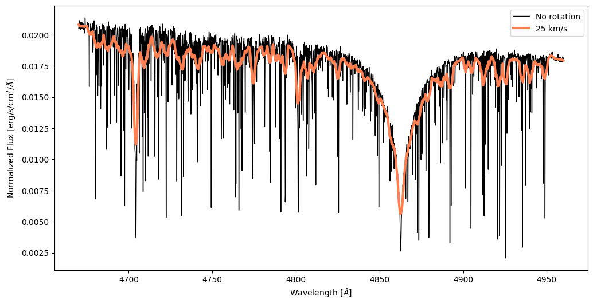
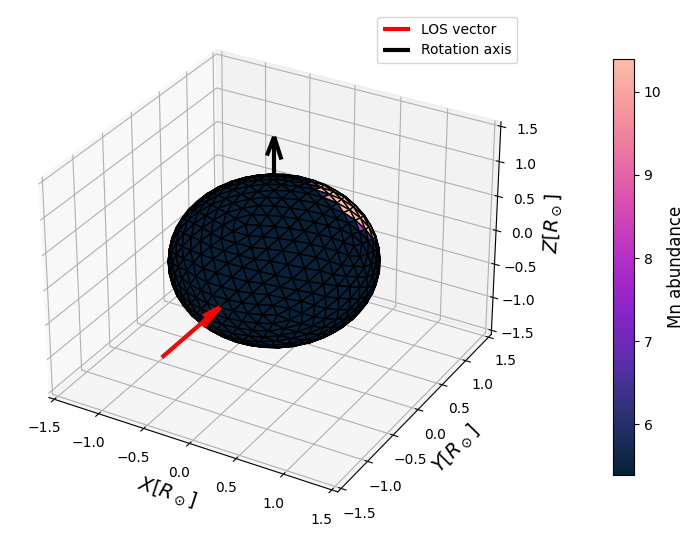

TransformerPayne Integration
===========================

The TransformerPayne model is our recommended model for spectra emulation. It is a neural network that can be used to predict spectra from a given set of parameters, including individual abundances.
To read more about TransformerPayne, see the `arXiv paper <https://arxiv.org/abs/2407.05751>`_

Downloading TransformerPayne
------------

To download the TransformerPayne model, use the following code:

.. code-block:: python

    from transformer_payne import TransformerPayne

    tp = TransformerPayne.download()

Make sure to have the `transformer-payne` and `huggingface-hub` packages installed to use this function.

Creating a Mesh Model
------------

TranformerPayne has much more parameters, for example, individual abundances:

.. warning::

   Note that TransformerPayne expects temperature in log10 scale (logteff) rather than linear scale (teff). For example, for a star with Teff = 8340K, you would need to provide logteff=np.log10(8340) ≈ 3.92.

.. code-block:: python

    from spice.models import IcosphereModel
    import jax.numpy as jnp

    m = IcosphereModel.construct(1000, 1., 1.,
                                 tp.to_parameters(dict(logteff=jnp.log10(7000), logg=4.3, O=8.0, Si=6.0)),
                                 tp.stellar_parameter_names)

Spectrum Calculation
------------

Currently, TransformerPayne contains GALAH DR3 lines.

An example of a spectrum generated for a rotating model is shown below:

.. code-block:: python

    from spice.models.mesh_transform import add_rotation, evaluate_rotation
    from spice.spectrum.spectrum import simulate_observed_flux

    mt = add_rotation(m, 100, jnp.array([0., 0., 1.]))
    mt = evaluate_rotation(mt, 0.)

    vws = np.linspace(4670, 4960, 2000)
    spec_no_rot = simulate_observed_flux(tp.intensity, m, jnp.log10(vws))
    spec_rot = simulate_observed_flux(tp.intensity, mt, jnp.log10(vws))

The spectrum can be plotted using the following code:

.. code-block:: python

    _, ax = plt.subplots(figsize=(12, 6))
    plt.plot(vws, spec_no_rot[:, 0], color='black', linewidth=1, label='No rotation')
    plt.plot(vws, spec_rot[:, 0], color='royalblue', linewidth=3, label='25 km/s')
    ax.set_xlabel(r'Wavelength [$\AA$]')
    ax.set_ylabel(r'Normalized Flux [erg/s/cm$^2$/$\AA$]');
    plt.legend()
    plt.show()

Line Profiles
------------

Line profiles for spotted star models can be calculated using the following code:

.. code-block:: python

    from spice.models.spots import add_spot
    import numpy as np

    timestamps = np.linspace(0, 48*3600, 100)

    m_spotted = add_spot(m, spot_center_theta=1., spot_center_phi=1., spot_radius=30., parameter_delta=5.0, parameter_index=tp.parameter_names.index('Mn'))
    m_spotted = [evaluate_rotation(add_rotation(m_spotted, 25.), t) for t in timestamps]

Models for various phases can be visualized using the following code:

.. code-block:: python
    
    from spice.plots import plot_3D

    fig, plot_ax = plot_3D(m_spotted[0], property_label='Mn abundance', property=tp.parameter_names.index('Mn'))

.. code-block:: python

    fig, plot_ax = plot_3D(m_spotted[50], property_label='Mn abundance', property=tp.parameter_names.index('Mn'))

Magnesium spot was chosen because of its spectral lines within one of the GALAH DR3 windows.

The spectra can be calculated using the following code:

.. code-block:: python

    vws = np.linspace(4762, 4769, 2000)
    spec_rot_spotted = [simulate_observed_flux(tp.intensity, _m_spotted, jnp.log10(vws)) for _m_spotted in m_spotted]

The line profiles can be plotted using the following code:

.. code-block:: python

    _, ax = plt.subplots(figsize=(12, 6))
    # Plot the spectra with colors based on timesteps
    # Create color map for different timesteps using magma
    colors = plt.cm.cool(np.linspace(0, 1, len(spec_rot_spotted)))

    # Plot each spectrum with color based on timestep
    for i, spectrum in enumerate(spec_rot_spotted):
        plt.plot(vws, spectrum[:, 0], color=colors[i], linewidth=1, alpha=0.5)
        
    # Create a ScalarMappable for the colorbar
    sm = plt.cm.ScalarMappable(cmap=plt.cm.cool, norm=plt.Normalize(vmin=0, vmax=timestamps[-1]/(3600)))
    plt.colorbar(sm, ax=ax, label='Time [h]')

    # Add a colorbar
    ax.set_xlabel(r'Wavelength [$\AA$]')
    ax.set_ylabel(r'Flux [erg/s/cm$^2$/$\AA$]')
    plt.show()

Similarly, line profiles can be calculated for pulsating models. For example, a very simple pulsating model with a period of 5 days:

.. code-block:: python

    m = IcosphereModel.construct(5000, 1., 1.,
                                tp.to_parameters(dict(logteff=np.log10(8340), logg=4.3)), tp.stellar_parameter_names)
    mp = add_pulsation(m, 0, 0, 5., jnp.array([[1e-4, 0.]]))

    TIMESTAMPS = jnp.linspace(0., 5., 20)

    mps = [evaluate_pulsations(m, t) for t in tqdm(TIMESTAMPS)]

for which we can calculate spectra with TransformerPayne:

.. code-block:: python

    vws = np.linspace(4762, 4769, 2000)
    specs = [simulate_observed_flux(tp.intensity, _m_pulsating, jnp.log10(vws)) for _m_pulsating in mps]

and plot them using the following code:

.. code-block:: python

    import cmasher as cmr

    # Create a colormap based on the timestamps
    cmap = cmr.bubblegum
    norm = plt.Normalize(TIMESTAMPS.min(), TIMESTAMPS.max())
    fig, ax = plt.subplots()

    # Plot the spectra with colors corresponding to timestamps
    for spec, timestamp in zip(specs, TIMESTAMPS):
        ax.plot(vws, spec[:, 0], color=cmap(norm(timestamp)))

    # Add a colorbar
    sm = plt.cm.ScalarMappable(cmap=cmap, norm=norm)
    sm.set_array([])  # This line is necessary for the colorbar to work correctly
    cbar = plt.colorbar(sm, ax=ax, ticks=TIMESTAMPS)
    cbar.set_label('Time [d]')

    # Set the colorbar tick labels to the timestamp values
    cbar.set_ticklabels([f'{t:.2f}' for t in TIMESTAMPS])

    plt.gca().set_xlabel(r'Wavelength [$\AA$]')
    plt.gca().set_ylabel(r'Intensity [erg/s/cm$^2$/$\AA$]')
    plt.gca().tick_params(axis='x', rotation=45)

